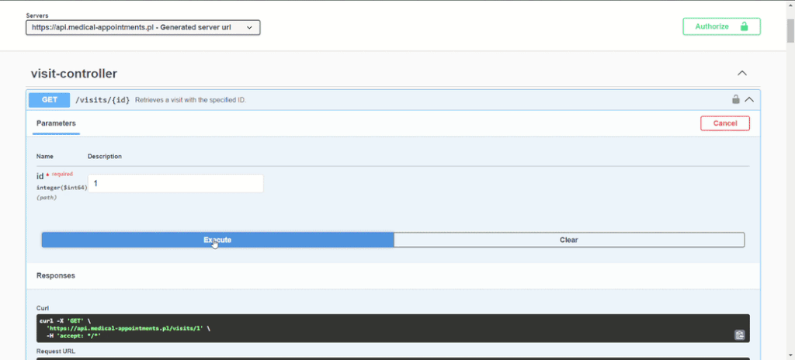
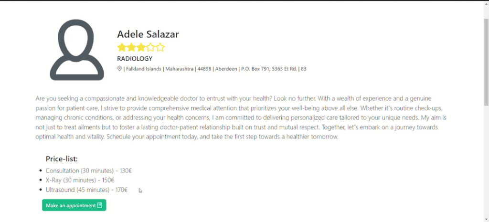
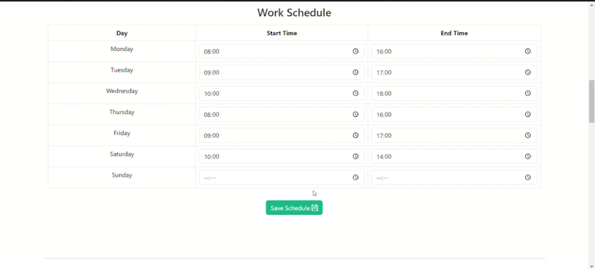
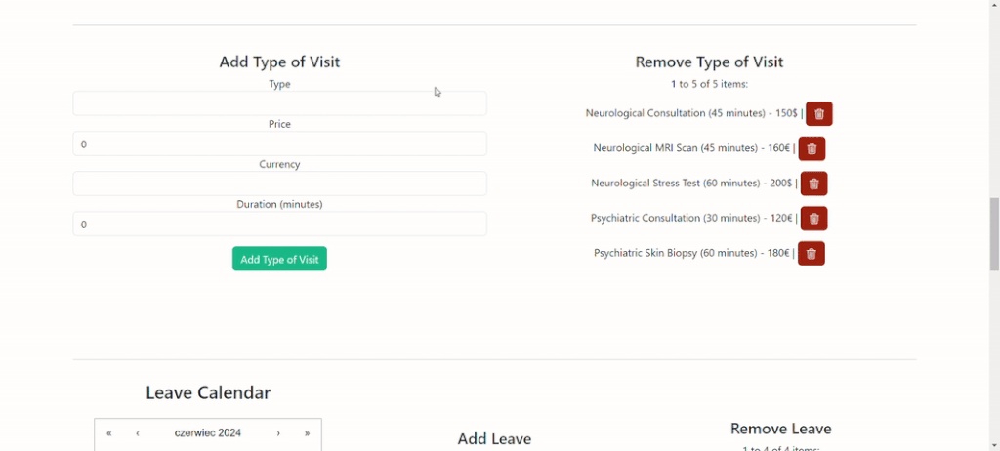
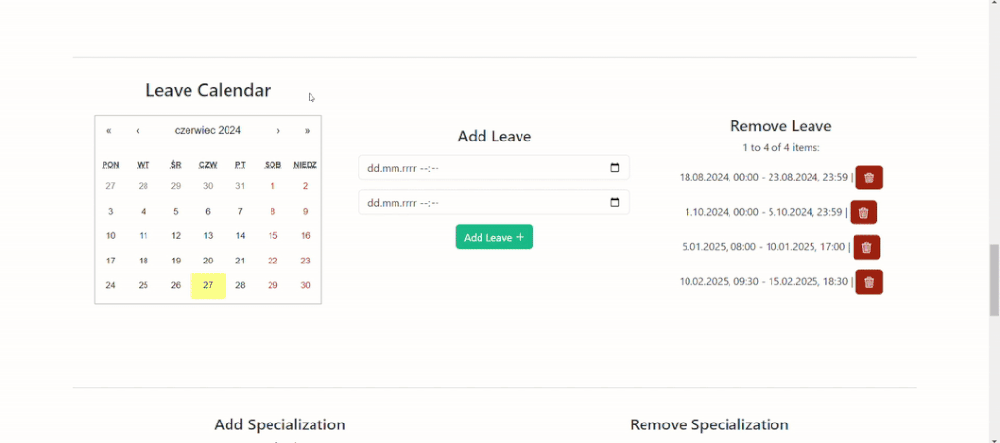
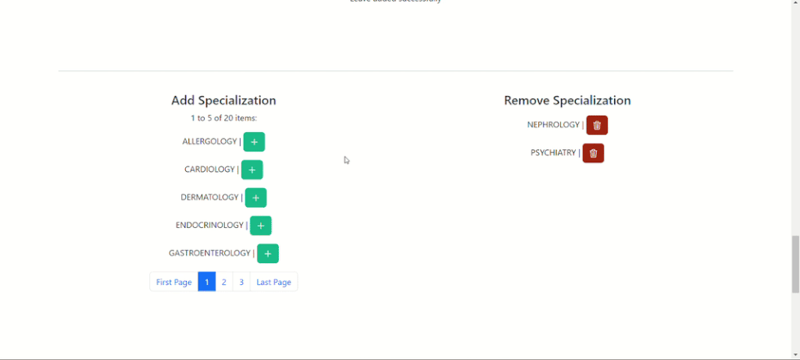
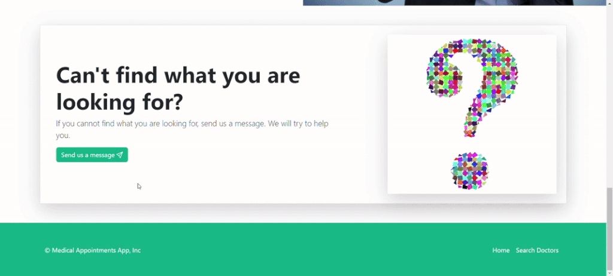
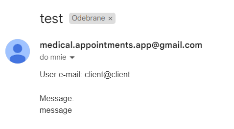

# Medical Appointments Frontend

This is the frontend layer for the [Medical Appointments](https://medical-appointments.pl) application. 
<br>You can see backend GitHub Repository [here](https://github.com/konradcz2001/medical-appointments-backend).


## Table of Contents

- [Project Description](#project-description)
- [Features](#features)
- [Technologies Used](#technologies-used)
- [API Documentation](#api-documentation)
- [Hosting](#hosting)
- [Sample Login Data](#sample-login-data)
- [Visual Examples](#visual-examples)
- [Setup Instructions](#setup-instructions)
- [Contributing](#contributing)
- [License](#license)

## Project Description

This project is a web application built with React and TypeScript. It includes various features such as user authentication, profile management, and visits arrangement. The application is configured using CRACO for custom Webpack configurations.


## Features
- The application supports user authentication, allowing users to log in and manage their profiles.
- Users can manage their profiles, including updating personal information and viewing their activity.
- The application allows users to arrange medical visits, making it easier to schedule appointments with doctors.
- The frontend interacts with a backend API to fetch and manage data. The API documentation is available via Swagger.
- The project provides sample login credentials for different types of users (Doctor, Client, Admin) to facilitate testing.
- The application includes a rating system for doctors. Clients can leave reviews, and doctors can verify their credentials, which are then checked by the team. Verified doctors receive a verification stamp. 
- If you have any additional questions, the app allows you to ask them.

## Technologies Used

- React
- Typescript

## API Documentation
The application interacts with a backend API to fetch and manage data. 
The API documentation is available via Swagger. You can access it [here](https://api.medical-appointments.pl/swagger-ui/index.html).
<br><br>For some operations you must log in and provide a token. You can log in with [Sample Login Data](#sample-login-data).



Swagger cannot distinguish endpoints with the same path and http method, so some GET endpoints are combined into one with all parameters required. For more details, see the code.

## Hosting
You can access the application via the links:
##### The entire application with frontend:<br> https://medical-appointments.pl
##### Swagger documentation for backend:<br> https://api.medical-appointments.pl/swagger-ui/index.html

## Sample Login Data

Here are some sample login credentials that you can use to test the application:

- **Doctor User**
   - Email: `doctor@doctor`
   - Password: `Doctor!123`
<br><br>
- **Client User**
   - Email: `client@client`
   - Password: `Client!123`
     <br><br>

- **Admin User**
   - Email: `admin@admin`
   - Password: `admin`

## Visual Examples
#### Doctor searching:

#### Booking an appointment:

#### Updating profile data:

#### Doctor's schedule update:

#### Doctor's type of visit update:

#### Doctor's leave update:

#### Doctor's specialization update and visit cancellation:

#### Sending a inquiry:

#### In mailbox:


## Setup Instructions

#### Installation

1. Clone the repository:

    ```bash
    git clone https://github.com/konradcz2001/medical-appointments-frontend.git
    cd medical-appointments-frontend
    ```

2. Add to the `.env` file:
    - Add new variable:
    ```bash
    REACT_APP_API='https://api.medical-appointments.pl/'
    ```
    - Or if you are using local backend then set it up to your URI, e.g.
    ```bash
    REACT_APP_API='http://localhost:8080/'
    ```


3. Install dependencies:
    ```bash
    npm install
    ```

4. Start the development server:
    ```bash
    npm start
    ```

#### Usage

After starting the development server, you can access the application at `http://localhost:3000`.

#### Running Tests

To run tests, use the following command:
```bash
npm test
```
## Contributing
Contributions are welcome! Please fork the repository and create a pull request with your changes. You can also contact me: konradcz2001@gmail.com

## License
This project is licensed under the [MIT License](LICENSE).<br><br>

