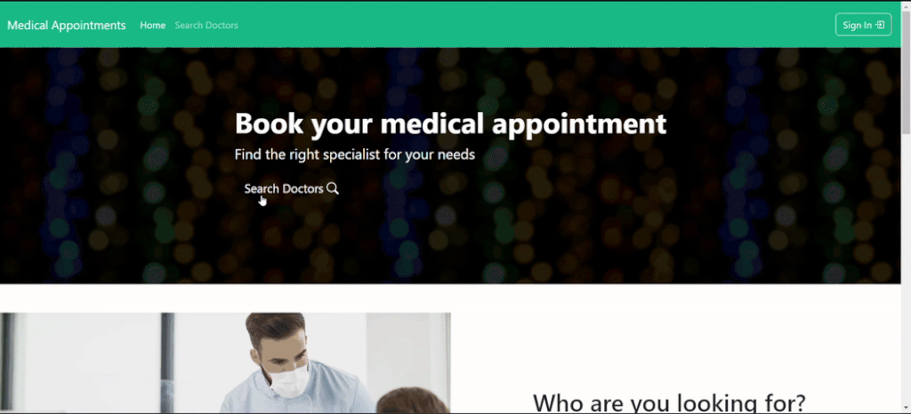
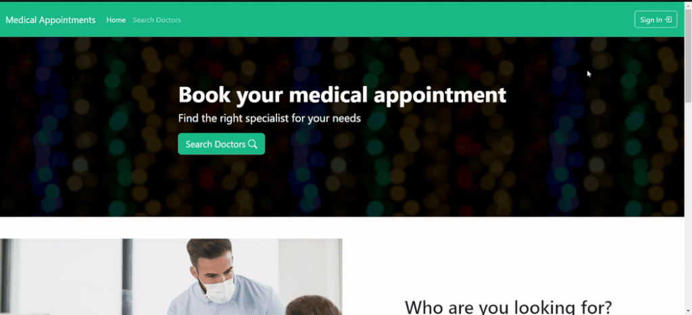

# Medical Appointments Frontend

This is the frontend layer for the [Medical Appointments](https://medical-appointments.pl) application. 
<br>You can see backend GitHub Repository [here](https://github.com/konradcz2001/medical-appointments-backend).


## Table of Contents

- [Project Description](#page_facing_up-project-description)
- [Features](#sparkles-features)
- [Technologies Used](#hammer_and_wrench-technologies-used-leftwards_arrow_with_hook)
- [API Documentation](#books-api-documentation-leftwards_arrow_with_hook)
- [Hosting](#globe_with_meridians-hosting-leftwards_arrow_with_hook)
- [Sample Login Data](#closed_lock_with_key-sample-login-data-leftwards_arrow_with_hook)
- [Visual Examples](#movie_camera-visual-examples-leftwards_arrow_with_hook)
- [Setup Instructions](#gear-setup-instructions-leftwards_arrow_with_hook)
- [Contributing](#handshake-contributing-leftwards_arrow_with_hook)
- [License](#scroll-license-leftwards_arrow_with_hook)

## :page_facing_up: Project Description

This project is a web application built with React and TypeScript. It includes various features such as user authentication, profile management, and visits arrangement. The application is configured using CRACO for custom Webpack configurations.


## :sparkles: Features
- The application supports user authentication, allowing users to log in and manage their profiles.
- Users can manage their profiles, including updating personal information and viewing their activity.
- The application allows users to arrange medical visits, making it easier to schedule appointments with doctors.
- The frontend interacts with a backend API to fetch and manage data. The API documentation is available via Swagger.
- The project provides sample login credentials for different types of users (Doctor, Client, Admin) to facilitate testing.
- The application includes a rating system for doctors. Clients can leave reviews, and doctors can verify their credentials, which are then checked by the team. Verified doctors receive a verification stamp. 
- If you have any additional questions, the app allows you to ask them.

## :hammer_and_wrench: Technologies Used [:leftwards_arrow_with_hook:](#table-of-contents)

- React
- Typescript

## :books: API Documentation [:leftwards_arrow_with_hook:](#table-of-contents)
The application interacts with a backend API to fetch and manage data. 
The API documentation is available via Swagger. You can access it [here](https://api.medical-appointments.pl/swagger-ui/index.html).
<br><br>For some operations you must log in and provide a token. You can log in with [Sample Login Data](#sample-login-data).


Swagger cannot distinguish endpoints with the same path and http method, so some GET endpoints are combined into one with all parameters required. For more details, see the code.

## :globe_with_meridians: Hosting [:leftwards_arrow_with_hook:](#table-of-contents)
You can access the application via the links:
##### The entire application with frontend:<br> https://medical-appointments.pl
##### Swagger documentation for backend:<br> https://api.medical-appointments.pl/swagger-ui/index.html

## :closed_lock_with_key: Sample Login Data [:leftwards_arrow_with_hook:](#table-of-contents)

Here are some sample login credentials that you can use to test the application:

- **Doctor User**
   - Email: `doctor@doctor`
   - Password: `Doctor!123`
<br><br>
- **Client User**
   - Email: `client@client`
   - Password: `Client!123`
     <br><br>

- **Admin User**
   - Email: `admin@admin`
   - Password: `admin`

## :movie_camera: Visual Examples [:leftwards_arrow_with_hook:](#table-of-contents)

- [Doctor searching](#doctor-searching)
- [Booking an appointment](#booking-an-appointment-leftwards_arrow_with_hook)
- [Updating profile data](#updating-profile-data-leftwards_arrow_with_hook)
- [Doctor's schedule update](#doctors-schedule-update-leftwards_arrow_with_hook)
- [Doctor's type of visit update](#doctors-type-of-visit-update-leftwards_arrow_with_hook)
- [Doctor's leave update](#doctors-leave-update-leftwards_arrow_with_hook)
- [Doctor's specialization update and visit cancellation](#doctors-specialization-update-and-visit-cancellation-leftwards_arrow_with_hook)
- [Sending an inquiry](#sending-an-inquiry-leftwards_arrow_with_hook)
- [In mailbox](#in-mailbox-leftwards_arrow_with_hook)

### Doctor searching


### Booking an appointment [:leftwards_arrow_with_hook:](#movie_camera-visual-examples-leftwards_arrow_with_hook)


### Updating profile data [:leftwards_arrow_with_hook:](#movie_camera-visual-examples-leftwards_arrow_with_hook)


### Doctor's schedule update [:leftwards_arrow_with_hook:](#movie_camera-visual-examples-leftwards_arrow_with_hook)


### Doctor's type of visit update [:leftwards_arrow_with_hook:](#movie_camera-visual-examples-leftwards_arrow_with_hook)


### Doctor's leave update [:leftwards_arrow_with_hook:](#movie_camera-visual-examples-leftwards_arrow_with_hook)


### Doctor's specialization update and visit cancellation [:leftwards_arrow_with_hook:](#movie_camera-visual-examples-leftwards_arrow_with_hook)


### Sending an inquiry [:leftwards_arrow_with_hook:](#movie_camera-visual-examples-leftwards_arrow_with_hook)


### In mailbox [:leftwards_arrow_with_hook:](#movie_camera-visual-examples-leftwards_arrow_with_hook)


## :gear: Setup Instructions [:leftwards_arrow_with_hook:](#table-of-contents)

#### Installation

1. Clone the repository:

    ```bash
    git clone https://github.com/konradcz2001/medical-appointments-frontend.git
    cd medical-appointments-frontend
    ```

2. Add to the `.env` file:
    - Add new variable:
    ```bash
    REACT_APP_API='https://api.medical-appointments.pl/'
    ```
    - Or if you are using local backend then set it up to your URI, e.g.
    ```bash
    REACT_APP_API='http://localhost:8080/'
    ```


3. Install dependencies:
    ```bash
    npm install
    ```

4. Start the development server:
    ```bash
    npm start
    ```

#### Usage

After starting the development server, you can access the application at `http://localhost:3000`.

#### Running Tests

To run tests, use the following command:
```bash
npm test
```
## :handshake: Contributing [:leftwards_arrow_with_hook:](#table-of-contents)
Contributions are welcome! Please fork the repository and create a pull request with your changes. You can also contact me: konradcz2001@gmail.com

## :scroll: License [:leftwards_arrow_with_hook:](#table-of-contents)
This project is licensed under the [MIT License](LICENSE).<br><br>

